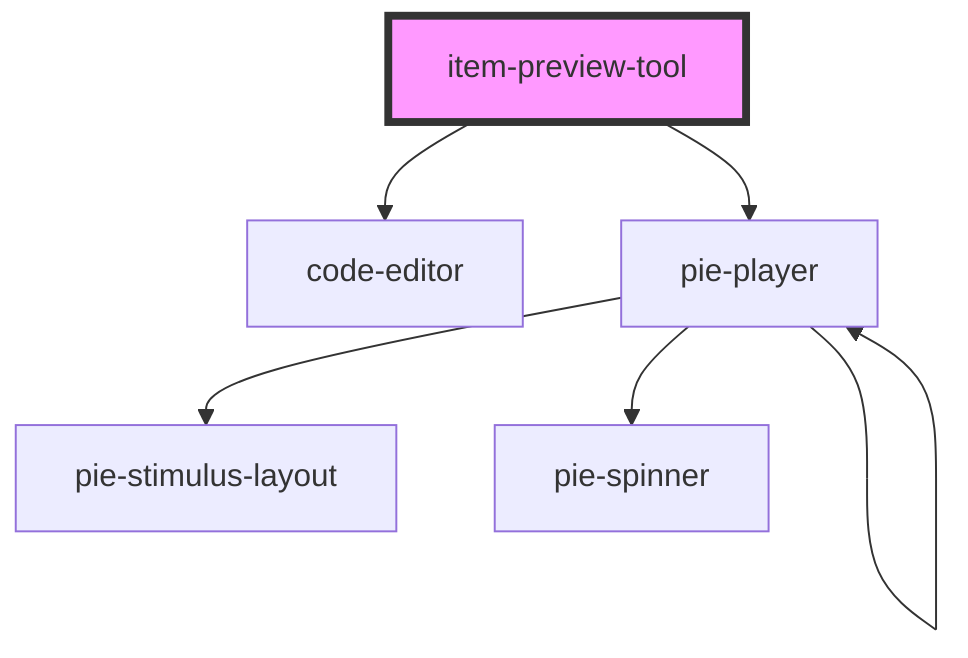

# item-preview-tool

<!-- Auto Generated Below -->

## Properties

| Property | Attribute | Description | Type     | Default                                |
| -------- | --------- | ----------- | -------- | -------------------------------------- |
| `text`   | `text`    |             | `string` | `JSON.stringify(demoItem, null, "  ")` |

## Dependencies

### Depends on

- [code-editor](.)
- [pie-player](../pie-player)

### Graph

----------------------------------------------

