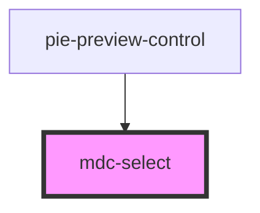

# mdc-select

<!-- Auto Generated Below -->

## Properties

| Property  | Attribute | Description | Type       | Default     |
| --------- | --------- | ----------- | ---------- | ----------- |
| `options` | --        |             | `Option[]` | `undefined` |
| `prompt`  | `prompt`  |             | `string`   | `undefined` |
| `value`   | `value`   |             | `string`   | `undefined` |

## Events

| Event          | Description | Type                  |
| -------------- | ----------- | --------------------- |
| `valueChanged` |             | `CustomEvent<string>` |

## Dependencies

### Used by

 - [pie-preview-control](../pie-preview-control)

### Graph

----------------------------------------------

