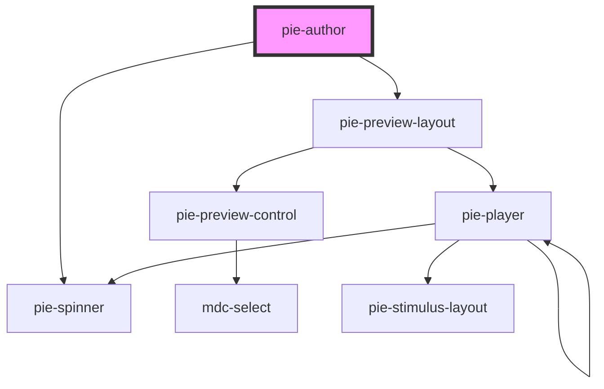

# pie-author

  
### Showing a Loader

This component loads the bundled JS assets from the build service. While these assets are loading 
The class `pie-loading` will be added to the element while assets are being loaded from the server.
  
 

<!-- Auto Generated Below -->

## Properties

| Property         | Attribute         | Description                                                                                                                                                                                                                                                                                                                                  | Type                                 | Default                     |
| ---------------- | ----------------- | -------------------------------------------------------------------------------------------------------------------------------------------------------------------------------------------------------------------------------------------------------------------------------------------------------------------------------------------- | ------------------------------------ | --------------------------- |
| `addPreview`     | `add-preview`     | Adds a preview view which will render the content in another tab as it may appear to a student or instructor.                                                                                                                                                                                                                                | `boolean`                            | `false`                     |
| `addRubric`      | `add-rubric`      | If set the player will add a rubric authoring interaction to the config                                                                                                                                                                                                                                                                      | `boolean`                            | `undefined`                 |
| `config`         | --                | The Pie config model.                                                                                                                                                                                                                                                                                                                        | `AdvancedItemConfig \| PieContent`   | `undefined`                 |
| `configSettings` | --                | To customize the standard behaviour provided by interaction configuration views you can provide settings key-ed by the package name.  e.g.  `{ '@pie-element/inline-choice': { promptLabel: 'Item Stem' } }`  The settings that are configurable for each authoring view are documented in the `@package-name/docs` folder for each package. | `{ [packageName: string]: Object; }` | `undefined`                 |
| `disableBundler` | `disable-bundler` | Allows disabling of the default behaviour which is to look up and load the JS bundle that define the Custom Elements used by the item config. This if for advanced use cases when using the pie-player in a container that is managing loading of Custom Elements and Controllers.                                                           | `boolean`                            | `false`                     |
| `imageSupport`   | --                | external providers can set this if they need to upload the assets to the cloud etc. by default we use data urls                                                                                                                                                                                                                              | `ExternalImageSupport`               | `new DataURLImageSupport()` |
| `loader`         | --                |                                                                                                                                                                                                                                                                                                                                              | `PieBundleLoader`                    | `undefined`                 |
| `version`        | `version`         |                                                                                                                                                                                                                                                                                                                                              | `string`                             | `VERSION`                   |

## Events

| Event          | Description                                                                                | Type               |
| -------------- | ------------------------------------------------------------------------------------------ | ------------------ |
| `modelLoaded`  | Emmitted when the content models in the config have been set on the content                | `CustomEvent<any>` |
| `modelUpdated` | Emmitted when the model for the content has been updated within the ui due to user action. | `CustomEvent<any>` |

## Methods

### `addRubricToConfig(config: ItemConfig, rubricModel?: any) => Promise<PieContent>`

**[DEPRECATED]** this method is for temporary use, will be removed at next major release  Utility method to add a `@pie-element/rubric` section to an item config when creating an item should be used before setting the config.

#### Returns

Type: `Promise<PieContent>`

## Dependencies

### Depends on

- [pie-preview-layout](../pie-preview-layout)
- [pie-spinner](../pie-spinner)

### Graph

----------------------------------------------

