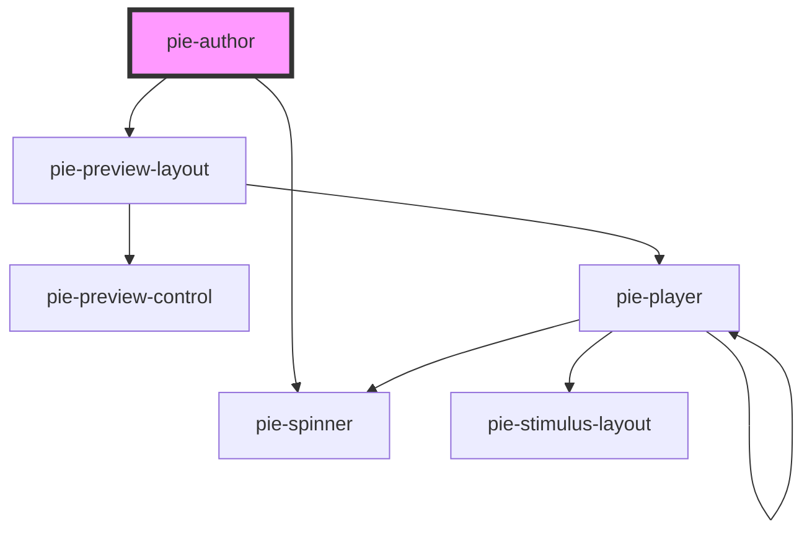

# pie-author

  
### Showing a Loader

This component loads the bundled JS assets from the build service. While these assets are loading 
The class `pie-loading` will be added to the element while assets are being loaded from the server.
  
 

<!-- Auto Generated Below -->

## Properties

| Property                    | Attribute                   | Description                                                                                                                                                                                                                                                                                                                                                                                                                                                                            | Type                                 | Default                           |
| --------------------------- | --------------------------- | -------------------------------------------------------------------------------------------------------------------------------------------------------------------------------------------------------------------------------------------------------------------------------------------------------------------------------------------------------------------------------------------------------------------------------------------------------------------------------------- | ------------------------------------ | --------------------------------- |
| `addPreview`                | `add-preview`               | Adds a preview view which will render the content in another tab as it may appear to a student or instructor.                                                                                                                                                                                                                                                                                                                                                                          | `boolean`                            | `false`                           |
| `addRubric`                 | `add-rubric`                | If set the player will add a rubric authoring interaction to the config                                                                                                                                                                                                                                                                                                                                                                                                                | `boolean`                            | `undefined`                       |
| `bundleEndpoints`           | --                          | Provide this property override the default endpoints used by the player to retrieve JS bundles. Must be set before setting the config property. Most users will not need to use this property.                                                                                                                                                                                                                                                                                         | `BundleEndpoints`                    | `undefined`                       |
| `bundleFormat`              | `bundle-format`             | Specifies the bundle format to use for loading PIE elements. - 'auto': Automatically detects browser support and uses ESM if available, falls back to IIFE (default, recommended) - 'esm': Force ESM loading (will fall back to IIFE if not supported) - 'iife': Force IIFE loading (all browsers)  In 'auto' mode, modern browsers (Chrome 89+, Firefox 108+, Safari 16.4+) will use ESM for better performance. Older browsers will automatically use IIFE. No configuration needed! | `"auto" \| "esm" \| "iife"`          | `'auto'`                          |
| `bundleHost`                | `bundle-host`               | Optionally specifies the back-end that builds and hosts javascript bundles for rendering assessment items. This property lets you choose which environment to use, from 'dev' , 'stage' or 'prod' environments. Until 1.0 will default to 'stage'. Starting v2.0.3, it will temporarily redirect to production only                                                                                                                                                                    | `string`                             | `undefined`                       |
| `canWatchConfigSettings`    | `can-watch-config-settings` | used in our demo environment to allow author to watch config settings and make updates defaults to false (do not set it to true because it was not tested properly)                                                                                                                                                                                                                                                                                                                    | `boolean`                            | `false`                           |
| `config`                    | --                          | The Pie config model.                                                                                                                                                                                                                                                                                                                                                                                                                                                                  | `AdvancedItemConfig \| PieContent`   | `undefined`                       |
| `configSettings`            | --                          | To customize the standard behaviour provided by interaction configuration views you can provide settings key-ed by the package name.  e.g.  `{ '@pie-element/inline-choice': { promptLabel: 'Item Stem' } }`  The settings that are configurable for each authoring view are documented in the `@package-name/docs` folder for each package.                                                                                                                                           | `{ [packageName: string]: Object; }` | `undefined`                       |
| `defaultComplexRubricModel` | --                          | To provide a way to add a default model to complex-rubric                                                                                                                                                                                                                                                                                                                                                                                                                              | `Object`                             | `undefined`                       |
| `disableBundler`            | `disable-bundler`           | Allows disabling of the default behaviour which is to look up and load the JS bundle that define the Custom Elements used by the item config. This if for advanced use cases when using the pie-player in a container that is managing loading of Custom Elements and Controllers.                                                                                                                                                                                                     | `boolean`                            | `false`                           |
| `esmCdnUrl`                 | `esm-cdn-url`               | Base URL for the ESM CDN when bundleFormat is 'esm'. Defaults to 'https://esm.sh' (public CDN).  Common options: - 'https://esm.sh' - Public CDN (default, open source) - 'https://proxy.pie-api.com/npm' - Private proxy with CloudFront caching - 'https://cdn.jsdelivr.net/npm' - Alternative public CDN  Only used when bundleFormat='esm'. Ignored for IIFE bundles.                                                                                                              | `string`                             | `'https://esm.sh'`                |
| `esmProbeCacheTtl`          | `esm-probe-cache-ttl`       | Cache TTL in milliseconds for package availability probe results. Default: 3600000ms (1 hour)  Use cases: - Production: Keep at 1 hour (package versions are immutable) - Development: Lower to 60000ms (1 minute) for testing - Long sessions: Increase to 86400000ms (24 hours) for stability  Only used when bundleFormat='auto' or 'esm'. Ignored for IIFE.                                                                                                                        | `number`                             | `60 * 60 * 1000`                  |
| `esmProbeTimeout`           | `esm-probe-timeout`         | Timeout in milliseconds for probing package availability on the CDN. Default: 1000ms (1 second)  Use cases: - Fast networks: Lower to 500ms for quicker fallback - Slow networks: Increase to 2000ms to avoid premature timeouts - Development: Lower to 500ms for faster iteration  Only used when bundleFormat='auto' or 'esm'. Ignored for IIFE.                                                                                                                                    | `number`                             | `1000`                            |
| `imageSupport`              | --                          | external providers can set this if they need to upload the assets to the cloud etc. by default we use data urls                                                                                                                                                                                                                                                                                                                                                                        | `ExternalImageSupport`               | `new DataURLImageSupport()`       |
| `isInsidePieApiAuthor`      | `is-inside-pie-api-author`  | If pie-author is used inside pie-api-author component. Do not set it manually.                                                                                                                                                                                                                                                                                                                                                                                                         | `boolean`                            | `false`                           |
| `loaderConfig`              | --                          | The Pie loader config.                                                                                                                                                                                                                                                                                                                                                                                                                                                                 | `{ trackPageActions?: boolean; }`    | `undefined`                       |
| `reFetchBundle`             | `re-fetch-bundle`           | used to automatically re-fetch the bundle (in case we get a 503)                                                                                                                                                                                                                                                                                                                                                                                                                       | `boolean`                            | `false`                           |
| `uploadSoundSupport`        | --                          | external providers can set this if they need to upload the assets to the cloud etc. by default we use data urls                                                                                                                                                                                                                                                                                                                                                                        | `ExternalUploadSoundSupport`         | `new DataURLUploadSoundSupport()` |
| `version`                   | `version`                   |                                                                                                                                                                                                                                                                                                                                                                                                                                                                                        | `string`                             | `VERSION`                         |

## Events

| Event          | Description                                                                                | Type               |
| -------------- | ------------------------------------------------------------------------------------------ | ------------------ |
| `modelLoaded`  | Emmitted when the content models in the config have been set on the content                | `CustomEvent<any>` |
| `modelUpdated` | Emmitted when the model for the content has been updated within the ui due to user action. | `CustomEvent<any>` |

## Methods

### `addMultiTraitRubricToConfig(config: ItemConfig, multiTraitRubricModel?: any) => Promise<PieContent>`

Utility method to add a `@pie-element/multi-trait-rubric` section to an item config when creating an item should be used before setting the config.
*

#### Returns

Type: `Promise<PieContent>`

### `addRubricToConfig(config: ItemConfig, rubricModel?: any) => Promise<PieContent>`

**[DEPRECATED]** this method is for temporary use, will be removed at next major release  Utility method to add a `@pie-element/rubric` section to an item config when creating an item should be used before setting the config.

#### Returns

Type: `Promise<PieContent>`

### `validateModels() => Promise<any>`

#### Returns

Type: `Promise<any>`

## Dependencies

### Depends on

- [pie-preview-layout](../pie-preview-layout)
- [pie-spinner](../pie-spinner)

### Graph

----------------------------------------------

