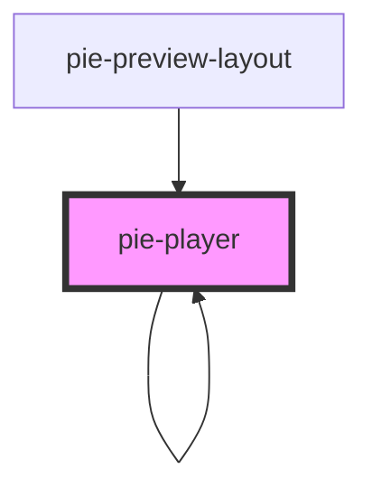

# pie-player

The `pie-player` component will load pie content for rendering.
  
### Showing a Loader

This component loads the bundled JS assets from the build service. While these assets are loading 
The class `pie-loading` will be added to the element while assets are being loaded from the server.
  
 

<!-- Auto Generated Below -->

## Properties

| Property                | Attribute                 | Description                                                                                                                                                                                                                                                                                                                                                                                                                                                                                           | Type                                                                        | Default                               |
| ----------------------- | ------------------------- | ----------------------------------------------------------------------------------------------------------------------------------------------------------------------------------------------------------------------------------------------------------------------------------------------------------------------------------------------------------------------------------------------------------------------------------------------------------------------------------------------------- | --------------------------------------------------------------------------- | ------------------------------------- |
| `addCorrectResponse`    | `add-correct-response`    | Simulates a correct response for the item. This property will only have this effect if the `hosted` property is false and player is running client-side-only.                                                                                                                                                                                                                                                                                                                                         | `boolean`                                                                   | `false`                               |
| `allowedResize`         | `allowed-resize`          | Allow to resize pie-stimulus layout Set this property to false to not render the resizer.                                                                                                                                                                                                                                                                                                                                                                                                             | `boolean`                                                                   | `false`                               |
| `bundleEndpoints`       | --                        | Provide this property override the default endpoints used by the player to retrieve JS bundles. Must be set before setting the config property. Most users will not need to use this property.                                                                                                                                                                                                                                                                                                        | `BundleEndpoints`                                                           | `undefined`                           |
| `bundleHost`            | `bundle-host`             | Optionally specifies the back-end that builds and hosts javascript bundles for rendering assessment items. This property lets you choose which environment to use, from 'dev' , 'stage' or 'prod' environments. Until 1.0 will default to 'stage'. Starting v2.0.3, it will temporarily redirect to production only                                                                                                                                                                                   | `string`                                                                    | `undefined`                           |
| `config`                | --                        | The Pie config model.                                                                                                                                                                                                                                                                                                                                                                                                                                                                                 | `AdvancedItemConfig \| PieContent`                                          | `undefined`                           |
| `containerClass`        | `container-class`         | Optional CSS class for the item player container                                                                                                                                                                                                                                                                                                                                                                                                                                                      | `string`                                                                    | `undefined`                           |
| `customClassname`       | `custom-classname`        | A custom class name to scope the styles to the pie-player component. The custom class name is used to scope the styles from the externalStyleUrls property, by using the pie-player.[CUSTOM_CLASS] selector. If not provided, a random class will be generated, such as `pie-player-abc12345`. This is useful for styling the pie-player component in a specific way, without affecting other components that may use the same styles.                                                                | `string`                                                                    | `''`                                  |
| `disableBundler`        | `disable-bundler`         | Allows disabling of the default behaviour which is to look up and load the JS bundle that define the Custom Elements used by the item config. This if for advanced use cases when using the pie-player in a container that is managing loading of Custom Elements and Controllers.                                                                                                                                                                                                                    | `boolean`                                                                   | `false`                               |
| `env`                   | --                        | Describes runtime environment for the player.                                                                                                                                                                                                                                                                                                                                                                                                                                                         | `{ mode: String \| Mode; role: String \| Role; partialScoring?: boolean; }` | `{ mode: 'gather', role: 'student' }` |
| `externalStyleUrls`     | `external-style-urls`     | Support styling with external stylesheet urls (comma separated urls) Target the pie-player component using the class provided in the class property Parse the css file and add the class to the stylesheet to scope the styles The last stylesheet url takes priority if the selectors have the same specificity. If no class is provided, a random class will be generated to scope the styles. We did not use the shadow DOM for the pie-player component, so we need to scope the styles manually. | `string`                                                                    | `''`                                  |
| `hosted`                | `hosted`                  | Indicates if player running in the context of a PIE hosting system. Do not modify the default value for this property if you are not implementing a PIE host. If true, the host is responsible for all model updates.                                                                                                                                                                                                                                                                                 | `boolean`                                                                   | `false`                               |
| `loaderConfig`          | --                        | The Pie loader config.                                                                                                                                                                                                                                                                                                                                                                                                                                                                                | `{ trackPageActions?: boolean; }`                                           | `undefined`                           |
| `passageContainerClass` | `passage-container-class` | Optional CSS class for the stimulus container wrapper                                                                                                                                                                                                                                                                                                                                                                                                                                                 | `string`                                                                    | `undefined`                           |
| `reFetchBundle`         | `re-fetch-bundle`         | used to automatically re-fetch the bundle (in case we get a 503)                                                                                                                                                                                                                                                                                                                                                                                                                                      | `boolean`                                                                   | `false`                               |
| `renderStimulus`        | `render-stimulus`         | If the item contains a stimulus, the player will render it by default. Set this property to false to not render stimulus.                                                                                                                                                                                                                                                                                                                                                                             | `boolean`                                                                   | `true`                                |
| `session`               | --                        | The Pie Session                                                                                                                                                                                                                                                                                                                                                                                                                                                                                       | `{ id: string; data: any[]; }`                                              | `{ id: '', data: [] }`                |
| `showBottomBorder`      | `show-bottom-border`      | In evaluate mode, add a bottom border to visually separate each item in the case of a multi-item                                                                                                                                                                                                                                                                                                                                                                                                      | `boolean`                                                                   | `false`                               |
| `version`               | `version`                 |                                                                                                                                                                                                                                                                                                                                                                                                                                                                                                       | `string`                                                                    | `VERSION`                             |

## Events

| Event               | Description                                                                                                                                                                                                                                                                                                                                                                                                                                                                   | Type               |
| ------------------- | ----------------------------------------------------------------------------------------------------------------------------------------------------------------------------------------------------------------------------------------------------------------------------------------------------------------------------------------------------------------------------------------------------------------------------------------------------------------------------- | ------------------ |
| `load-complete`     | Emitted when the content in the config has been loaded.                                                                                                                                                                                                                                                                                                                                                                                                                       | `CustomEvent<any>` |
| `player-error`      | Emmitted if there is an error encountered while rendering. `event.detail` will be a string containing a message about the error.                                                                                                                                                                                                                                                                                                                                              | `CustomEvent<any>` |
| `responseCompleted` | TODO - Emmitted when any all interactions in a PIE Assessment Item have reported that a user has provided a response to the interaction.                                                                                                                                                                                                                                                                                                                                      | `CustomEvent<any>` |
| `session-changed`   | Emmitted when any interaction in the set of interactions being rendered has been mutated by user action.  The `Event.detail` property contains a `complete` property. If true, this indicates that enough data has been gathered by the interaciton to constitute a response. For example, in a plot line questsion where a user had to plot three points to plot the line, the `complete` propery would be false if 1 or 2 points had been added, but true if all three had. | `CustomEvent<any>` |

## Methods

### `provideScore() => Promise<false | any[]>`

#### Returns

Type: `Promise<false | any[]>`

### `updateElementModel(update: PieModel) => Promise<void>`

For previewing changes to an item. Updates the model for one question in the item model.

#### Returns

Type: `Promise<void>`

## Dependencies

### Used by

 - [pie-player]()
 - [pie-preview-layout](../pie-preview-layout)

### Depends on

- [pie-stimulus-layout](../pie-stimulus-layout)
- [pie-player]()
- [pie-spinner](../pie-spinner)

### Graph

----------------------------------------------

