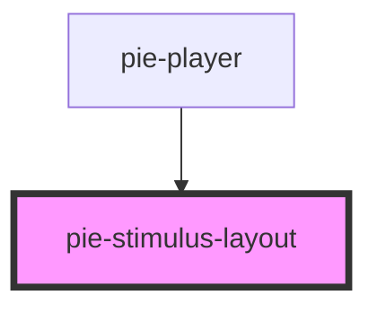

# pie-stimulus-layout

<!-- Auto Generated Below -->

## Properties

| Property        | Attribute        | Description | Type      | Default |
| --------------- | ---------------- | ----------- | --------- | ------- |
| `allowedResize` | `allowed-resize` |             | `boolean` | `false` |

## Dependencies

### Used by

 - [pie-player](../pie-player)

### Graph

----------------------------------------------

