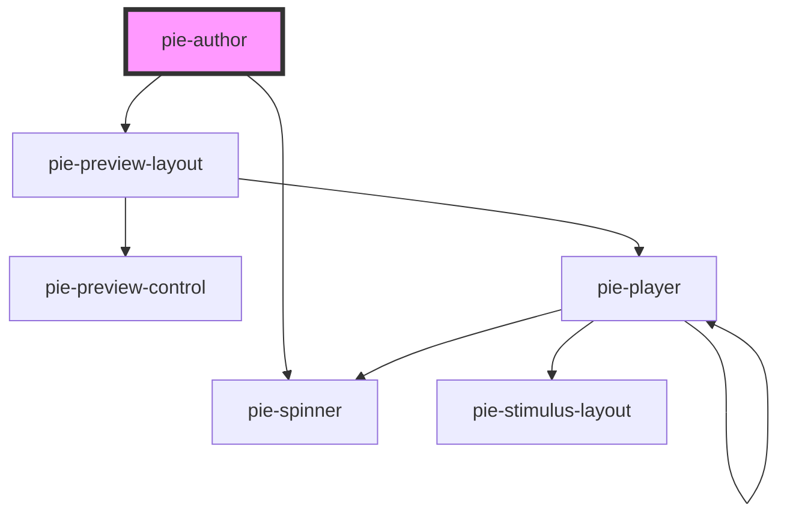

# pie-author

  
### Showing a Loader

This component loads the bundled JS assets from the build service. While these assets are loading 
The class `pie-loading` will be added to the element while assets are being loaded from the server.
  
 

<!-- Auto Generated Below -->

## Properties

| Property         | Attribute     | Description                                                                                                                                                                                                                                                                                                                                    | Type                                 | Default     |
| ---------------- | ------------- | ---------------------------------------------------------------------------------------------------------------------------------------------------------------------------------------------------------------------------------------------------------------------------------------------------------------------------------------------- | ------------------------------------ | ----------- |
| `addPreview`     | `add-preview` |                                                                                                                                                                                                                                                                                                                                                | `boolean`                            | `undefined` |
| `config`         | --            | The Pie config model.                                                                                                                                                                                                                                                                                                                          | `AdvancedItemConfig \| PieContent`   | `undefined` |
| `configSettings` | --            | To customize the standard behaviour provided by interaction configuration views you can  provide settings key-ed by the package name.  e.g.  `{ '@pie-element/inline-choice': { promptLabel: 'Item Stem' } }`  The settings that are configurable for each authoring view are documented in  the `@package-name/docs` folder for each package. | `{ [packageName: string]: Object; }` | `undefined` |

## Events

| Event          | Description                                                         | Type               |
| -------------- | ------------------------------------------------------------------- | ------------------ |
| `modelUpdated` | Emmitted when the model for the content has been updated in the ui. | `CustomEvent<any>` |

## Dependencies

### Depends on

- [pie-preview-layout](../pie-preview-layout)
- [pie-spinner](../pie-spinner)

### Graph

----------------------------------------------

*Built with [StencilJS](https://stenciljs.com/)*
