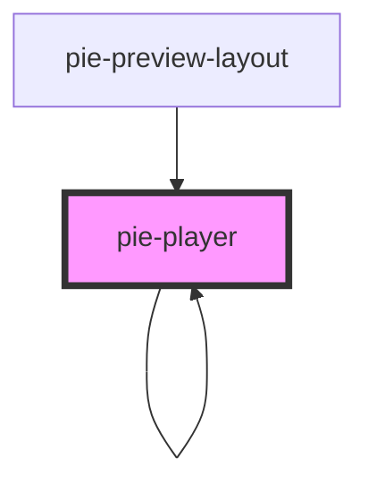

# pie-player

The `pie-player` component will load pie content for rendering.
  
### Showing a Loader

This component loads the bundled JS assets from the build service. While these assets are loading 
The class `pie-loading` will be added to the element while assets are being loaded from the server.
  
 

<!-- Auto Generated Below -->

## Properties

| Property         | Attribute         | Description                                                                                                                                                                                                           | Type                               | Default                               |
| ---------------- | ----------------- | --------------------------------------------------------------------------------------------------------------------------------------------------------------------------------------------------------------------- | ---------------------------------- | ------------------------------------- |
| `config`         | --                | The Pie config model.                                                                                                                                                                                                 | `AdvancedItemConfig \| PieContent` | `undefined`                           |
| `env`            | --                | Describes runtime environment for the player.                                                                                                                                                                         | `Object`                           | `{ mode: 'gather', role: 'student' }` |
| `hosted`         | `hosted`          | Indicates if player running in the context of a PIE hosting system. Do not modify the default value for this property if you are not implementing a PIE host. If true, the host is responsible for all model updates. | `boolean`                          | `false`                               |
| `jsBundleUrls`   | --                | If provided this url is used for loading the JS bundle for rendering the PIE Elements. If not provided the system will default to using the PIE Cloud service to locate and load JS bundles.                          | `string[]`                         | `undefined`                           |
| `renderStimulus` | `render-stimulus` | If the item contains a stimulus, the player will render it by default. Set this property to false to not render stimulus.                                                                                             | `boolean`                          | `true`                                |
| `session`        | --                | The Pie Session                                                                                                                                                                                                       | `{ id: string; data: any[]; }`     | `{id: "", data:[]}`                   |

## Events

| Event               | Description                                                                                                                               | Type               |
| ------------------- | ----------------------------------------------------------------------------------------------------------------------------------------- | ------------------ |
| `load-complete`     | Emitted when the content in the config has been loaded.                                                                                   | `CustomEvent<any>` |
| `player-error`      | Emmitted if there is an error encountered while rendering. `event.detail` will be a string containing a message about the error.          | `CustomEvent<any>` |
| `responseCompleted` | TODO - Emmitted when any all interactions in a PIE Assessment Item have reported that a user  has provided a response to the interaction. | `CustomEvent<any>` |
| `session-changed`   | Emmitted when any interaction in the set of interactions being rendered has been mutated by user action.                                  | `CustomEvent<any>` |

## Methods

### `updateElementModel(update: PieModel) => Promise<void>`

For previewing changes to an item. Updates the model for one question in the item model.

#### Returns

Type: `Promise<void>`

## Dependencies

### Used by

 - [pie-player]()
 - [pie-preview-layout](../pie-preview-layout)

### Depends on

- [pie-stimulus-layout](../pie-stimulus-layout)
- [pie-player]()
- [pie-spinner](../pie-spinner)

### Graph

----------------------------------------------

*Built with [StencilJS](https://stenciljs.com/)*
